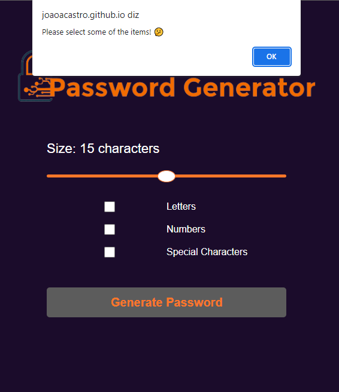

Project developed using only HTML5, CSS3 and JavaScript.

You can check this project online through this link: <a href="https://joaoacastro.github.io/passwordgenerator/" target="_blank"> Password Generator </a> 

 

 
## Thanks for visiting my project 😉
<i>You can check out other projects I've developed here on my GitHub, or contact me through the other links.</i>
 

